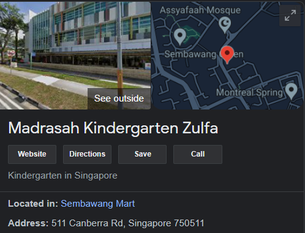

# Introduction

## Named Entity Recognition in the Urban Planning context

A lot of information can be presented in text. The fluidity of language means that text structures can both vary greatly and be very complex. Automating the extraction of information from text hence requires some form of Natural Language Processing (NLP).

NLP is a subset of artificial intelligence and involves the application of computational techniques to the analysis of human language. One key technique is Named Entity Recognition (NER) - the extraction of named entities (place names, persons, organisations, dates & times, etc.) from text. Modern NLP models often have tools to perform NER.

In the field of urban planning and analytics, NER models could be used to aid tagging of named entities (e.g. geotagging) and sentiment analysis.

## Project Objective

Create a re-trainable and potentially scalable Named Entity Recognition model for Singapore location names, using the spaCy library.

## Requirements

- Basic fundementals of Python 3 and pip.
- Some understanding of spaCy NLP Library (tutorial seperate from this markdown file)
- The specific software to be downloaded can be found on the requirements.txt file. Note that the requirements.txt file excludes the newspaper3k, wikipediaapi and doccano packages as well as their own required packages as it is used to run the Streamlit mini app.

## Table of Contents

- [Introduction](#introduction)
  - [Named Entity Recognition in the Urban Planning context](#named-entity-recognition-in-the-urban-planning-context)
  - [Project Objective](#project-objective)
  - [Requirements](#requirements)
  - [Table of Contents](#table-of-contents)
- [Models Available](#models-available)
  - [Pipes Available](#pipes-available)
- [Running the Model](#running-the-model)
  - [Running Model on Streamlit](#running-model-on-streamlit)
  - [Running Model within IDE](#running-model-within-ide)
- [Repo Organisation](#repo-organisation)
- [Model Creation Process](#model-creation-process)
  - [Location Data Collection & Cleaning](#location-data-collection--cleaning)
    - [Locations Entry Extraction](#locations-entry-extraction)
    - [Conversion of Entries to Standard Capitalisation](#conversion-of-entries-to-standard-capitalisation)
    - [Manual Cleaning of Extracted Data](#manual-cleaning-of-extracted-data)
  - [Sourcing Data for Annotations](#sourcing-data-for-annotations)
  - [Data Annotation](#data-annotation)
    - [Automated Annotations with spaCy EntityRuler](#automated-annotations-with-spacy-entityruler)
    - [Manual Annotations with Doccano](#manual-annotations-with-doccano)
    - [Conversion to spaCy v3.0 binary format](#conversion-to-spacy-v30-binary-format)
  - [Model Training](#model-training)
    - [Considerations and configuration for v1.1](#considerations-and-configuration-for-v11)
    - [Considerations and configuration for v2.0](#considerations-and-configuration-for-v20)
    - [Considerations and configuration for v3.0](#considerations-and-configuration-for-v30)

# Models Available

Two models were conceptualised to in creating the NER Model for Singapore location names.

1. A **Dictionary-centric Model** where a "dictionary of locations" would be added as an EntityRuler pipe, with a trained NER pipe acting as a backup.
2. An **Enhanced NER-based Model** where the NER pipe would be the sole pipe tagging locations.

| Models | Type               | Intent                                                   | Annotation Method | Recommended for Use |
| ------ | ------------------ | -------------------------------------------------------- | :---------------: | :-----------------: |
| v1.1   | Dictionary-centric | Build test pipeline                                      |    EntityRuler    |         ❌          |
| v2.0   | Dictionary-centric | Build base pipeline                                      |    EntityRuler    |         ❌          |
| v2.1   | Dictionary-centric | Add "Dictionary of Locations" to v2.0                    |    EntityRuler    |         ✔️          |
| v3.0   | Enhanced NER-based | Create more flexible model by only using an enhanced NER |      Doccano      |         ✔️          |

The Enhanced NER-based model is most flexible - it can pick out new locations, location names with case or spelling deviations, and has a rudimentary ability to differentiate named entities that can be tagged with both LOC and ORG

## Pipes Available

Pipes are arranged in order from left to right.

| Models | Tokenizer | POS Tagger | Dependency Parser | "Locations Dictionary" EntityRuler | NER |
| ------ | :-------: | :--------: | :---------------: | :--------------------------------: | :-: |
| v1.1   |    ✔️     |     ❌     |        ❌         |                 ❌                 | ✔️  |
| v2.0   |    ✔️     |     ✔️     |        ✔️         |                 ❌                 | ✔️  |
| v2.1   |    ✔️     |     ✔️     |        ✔️         |                 ✔️                 | ✔️  |
| v3.0   |    ✔️     |     ✔️     |        ✔️         |                 ❌                 | ✔️  |

# Running the Model

## Running Model on Streamlit

1. Ensure that packages and dependencies for Streamlit are downloaded into your environment.
2. In your terminal, change directory to the main folder of this repo. Type in:

```
streamlit run streamlit/model_demo.py
```

3. You can now view the app at http://localhost:8501/

Note that the Streamlit mini-app will only display Model v2.1 and v3.0.

## Running Model within IDE

1. Ensure that packages and dependencies for spaCy (& Jupyter Notebook, if desired) are downloaded into your environment.
2. Create a new Jupyter Notebook or Python file.
3. Import the following packages

```
import spacy
from spacy import displacy
```

4. Link the path to the model of choice, and load it.

- For models v1.0, v2.0 and v3.0, note that you will need to further reference the model-best folder

```
path = "models/model_v3.0/model_best"
nlp = spacy.load(path)
```

5. Type in your desired text for analysis and call the render function on display.

```
doc = nlp("This example text was created at 45 Maxwell Road.")
displacy.render(doc, style="ent")
```

# Repo Organisation

The repo is organised into the following folders:

| Folder           | Subfolder                  | Contents                                                                    |
| ---------------- | -------------------------- | --------------------------------------------------------------------------- |
| archive          |                            | Jupyter Notebooks use to trial certain scripts                              |
|                  | doccano_trial              | Imported data from a Doccano test annotation trial                          |
| data             | doccano_annotated_data     | Imported final Doccano annotations for v3.0                                 |
|                  | extracted_locations        | Singapore locations data, post-cleaning                                     |
|                  | singapore-postal-codes     | [OneMap Data](https://github.com/xkjyeah/singapore-postal-codes) by xkyyeah |
|                  | text_data                  | Text for annotations                                                        |
|                  | training_datasets          | Training and Test Datasets for spaCy in json and spacy binary formats       |
| documentation    |                            | Full documentation for the project                                          |
|                  | images                     | Image references for this documentation markdown file                       |
| models           | loc_er                     | _en_core_web_md_ model with "locations dictionary" EntityRuler pipe added   |
|                  | v1.1                       | Trial to create base model for Dictionary-centric method                    |
|                  | v2.0                       | Base model for Dictionary-centric method                                    |
|                  | v2.1                       | v2.0/model-best with "locations dictionary" EntityRuler pipe added          |
|                  | v3.0                       | Enhanced NER-based model                                                    |
| streamlit        |                            | Model Demo for Streamlit                                                    |
| training_config  |                            | Base configuration and final configuration files for models                 |
| trianing_scripts |                            | Scripts for model training common to both methods                           |
|                  | doccano_base_training      | Scripts for model training specific to Enhanced NER-based model             |
|                  | entity_ruler_base_training | Scripts for model training specific to Dictionary-centric model             |

# Model Creation Process

Different steps were taken to create Dictionary-centric Models (v1.0, v2.0, v2.1) and Enhanced NER-based Model (v3.0).

**Dictionary-centric Models**

1. Sourcing and cleaning location names data
2. Sourcing annotation data
3. Utilising the location names data to create annotations automatically with spaCy EntityRuler
4. Training the model with the annotations
5. Adding the location names data as an EntityRuler pipe

**Enhanced NER-based Model**

1. Sourcing annotation data
2. Creating annotations manually with Doccano
3. Training the model with the annotations

For a basic, yet detailed tutorial on how to train NER models with spaCy v3.0, I highly recommend Dr WJB Mattingly's series on [Youtube](https://www.youtube.com/playlist?list=PL2VXyKi-KpYvuOdPwXR-FZfmZ0hjoNSUo)

## Location Data Collection & Cleaning

**Relevant Script**: [training_scripts/entity_ruler_base_training/onemap_names_filter.ipynb](../training_scripts/entity_ruler_base_training/onemap_names_filter.ipynb)

For the location names and addresses data, a [repo of Singapore location names](https://github.com/xkjyeah/singapore-postal-codes) was cloned and saved to [data/singapore-postal-codes](../data/singapore-postal-codes/).

A raw data entry looks like this:


For each location data entry, the desired outcomes were as such:

1. Extract the building name, street name, postal code and address
2. Convert these item names from Title Case (block letters) to standard English capitalisation

### Locations Entry Extraction

For each location, extracting the building name, street name, postal code and address was desired. A script was created to extract the first three from the data entries directly.

For the latter, extracting a simple address consisting of the building/block number and street name was preferred over extracting the full, raw address entry. This is as location addresses in Singapore are more often referred to in this manner. The initial method to do so relied on the method below

    #not code
    SIMPLE ADDRESS = ADDRESS - POSTAL CODE - SEARCHVAL(if SEARCHVAL != ROAD NAME)

However, this method would not work for examples such this one, where the SEARCHVAL entry reflected the estate name, especially for private estates. The SIMPLE ADDRESS for this particular entry, for instance, would just be "1".


This would result in the simple address only being the building number. This occured for multiple estates. While some SEARCHVAL values were manually corrected, it was untenable to do so for all entries in the list of addresses and buildings. A second method was attempted to create the SIMPLE ADDRESS ENTRY

    #not code
    SIMPLE ADDRESS = BLK_NO + ROAD_NAME

The list was iterated over with this method, followed by removal of duplicate entries with _list(set(list))_.

### Conversion of Entries to Standard Capitalisation

As the data entries are in title case, a snippet of code was created to convert the entries to standard capitalisation before they were extracted. Proper capitalisation is one of the factors the spaCy pipeline takes into account when tagging named entities, therefore it was important that the location entries were converted from block letters to standard capitalisation.

A simple function was able to do the bulk of the work:

    def properly_capitalise(location_name):
      properly_capitalised_name = location_name.lower().title()
      return properly_capitalised_name

However, this method resulted in some oddities being output, especially when capital letters were used for non-first letters in the words.


### Manual Cleaning of Extracted Data

The building names list was manually looked through in order to correct any inaccuracies in letter case for each entry. During this process, it was also discovered that there were location entries that were merely tenants/organisations within the building, rather than being unique buildings with distinct adresses.

This particularly applied to kindergartens and pre-schools, which are typically housed below apartment blocks or in commercial buildings. These facilities were listed as locations in the original [OneMap Data](https://github.com/xkjyeah/singapore-postal-codes) repo as OneMap has a query function for kindergartens and pre-schools.

For instance, this particular pre-school ended up in the scraped list of buildings, when it is not a unique building but a tenant of the building.




The number of unique entries for building reduced was afterward reduced from 16000 to 11000. The list can be found in [data/extracted_locations/short_manual_buildings_name_list.json](../data/extracted_locations/short_manual_buildings_name_list.json).

The cleaned building names list was then compiled with the other extracted locations list in [data/extracted_locations/combined_locations.json](../data/extracted_locations/combined_locations.json)

## Sourcing Data for Annotations

**Relevant Scripts**:

- [training_scripts/entity_ruler_base_training/er_train_data_generator.ipynb](../training_scripts/entity_ruler_base_training/er_train_data_generator.ipynb)
- [training_scripts/doccano_base_training/data_to_doccano.ipynb](../training_scripts/doccano_base_training/data_to_doccano.ipynb)

Training of spaCy's NER pipe requires a dataset of sentences/text that has been annotated to highlight which words are named entities and what kind of named entities they are. The text was sourced from a variety of articles online.

For the NER pipe trained for the Dictionary-centric method, news articles and Wikipedia articles that had a multitude of location references were scraped. The **newspaper3k** and **wikipediaapi** packages were imported to scrape these articles directly. Refer to the [er_train_data_generator.ipnyb](../training_scripts/entity_ruler_base_training/er_train_data_generator.ipynb) script for the exact list of articles.

For the NER pipe trained for the Enhanced NER-based method, a few more news articles were added, and the selection of articles and sentences was broadened to include articles from food/travel blogs, property review websites, and an online complaints page. Articles from these sites often reference locations and addresses in a more informal and colloquial manner, and it would be good for the model to recognise location names that are mentioned as such.

**Sites featuring articles with "colloquial references" to Singapore locations**

- [Mothership](https://mothership.sg/)
- [Stacked Homes](https://stackedhomes.com/)
- [PropertyGuru](https://www.propertyguru.com.sg/)
- [Miss Tam Chiak](https://www.misstamchiak.com/)
- [Complaint Singapore](https://complaintsingapore.com/)
- [Complaint Singapore on Facebook](https://www.facebook.com/groups/complaintsingapore/)

Sentences from these sites were manually scraped and sometimes modified slightly to correct grammar. This was as location references were not as "abundant" as those from the previously selected list of news and Wikipedia articles, and using a package like beautifulsoup to scrape the articles would result in the need to further manually clean and delete the remainder of the sentences not containing location references anyway. The scraped sentences can be found at [data/text_data/informal_text_data.txt](../data/text_data/informal_text_data.txt)

## Data Annotation

In an NER model creation process, annotations highlight which set of words/letters are named entities. This is one example, with 1 organisation (ORG) and 2 unique locations (LOC) having been identified and their positions (by letter) indicated.


Annotations can either be created with a script or highlighted manually. The former is significantly faster, but fail to highlight named entities that are have case or spelling deviations, while the latter enables more accurate labelling at the expense of time.

### Automated Annotations with spaCy EntityRuler

**Relevant Scripts**:

- [training_scripts/entity_ruler_base_training/entity_ruler_v1.ipynb](../training_scripts/entity_ruler_base_training/entity_ruler_v1.ipynb)
- [training_scripts/entity_ruler_base_training/er_train_data_generator.ipynb](../training_scripts/entity_ruler_base_training/er_train_data_generator.ipynb)

The "Dictionary of Locations" EntityRuler used for the dictionary-centric models was originally envisaged to tag locations in the text being run through the model pipeline by referencing a list of locations.

With this feature in mind, a script could be written to use the EntityRuler to tag locations into the annotation format as seen above, effectively automating the process of annotation creation.

A visual representation of the EntityRuler creation and how it was utilised to generate annotation data is as follows:


The EntityRuler pipe was created in the [entity_ruler_v1.ipynb](../training_scripts/entity_ruler_base_training/entity_ruler_v1.ipynb) notebook with the [combined_locations.json](../data/extracted_locations/combined_locations.json) file being the reference for the locations. It was then added to an _en_core_web_sm_ model, placed before the latter's native NER pipe, and the new model saved as the [loc_er model](../models/loc_er)

In [er_train_data_generator.ipynb](../training_scripts/entity_ruler_base_training/er_train_data_generator.ipynb), the news and Wikipedia articles were scraped and broken into their constituent sentences. The [loc_er model](../models/loc_er) was then used to create the annotations. 924 sets of annotations were created, and were further split into TRAINING and TEST data in preparation for the training process. The annotation data generated was however in JSON format meant for spaCy v2.0, and needed to be further converted to spaCy v3.0's native binary file format, which will be addressed later.

### Manual Annotations with Doccano

**Relevant Scripts**

- [training_scripts/doccano_base_training/data_to_doccano.ipynb](../training_scripts/doccano_base_training/data_to_doccano.ipynb)
- [training_scripts/doccano_base_training/doccano_to_spacy2.ipynb](../training_scripts/doccano_base_training/doccano_to_spacy2.ipynb)

The native and preferred manual annotation creation package for spaCy is Explosion's [prodigy](https://prodi.gy/). Although it enables annotation data to be generated direct to spaCy v3.0 binary format, using it requires paying for a license. An alternative annotation generation package, [doccano](https://github.com/doccano/doccano), was instead used. As it accepts data in the _textline_ format and outputs data in the _JSONL_ format, extra steps are required to prepare the text data and convert the generated annotation data to the spaCy v2.0 JSON format, as seen below:


The manual annotation process, while lengthy, enables more accurate tagging of locations, and the ability to tag the same named entity with different tags based on context.

The articles first need to be broken up into their constituent sentences, which are then compiled into a txt file in textline format, as done in [data_to_doccano.ipynb](../training_scripts/doccano_base_training/data_to_doccano.ipynb). The compiled list of locations is saved as [data/text_data/filtered_textdata.txt](../data/text_data/filtered_textdata.txt]), and manually run through to pick out non utf-8 compliant characters. This is as having such characters will later down the line affect the exporting of output data from doccano. Some examples include the use of non-utf-8 compliant dashes and apostrophes.


Once the data has been cleaned, the project can be created. The setup is as below. Crucially, the project should be a **Sequence Labelling** project and the **_Allow Overlapping Enities_ checkbox should be UNTICKED**.


In annotating the text, named entities were either tagged as LOCATIONS, ORGANISATIONS or FACILITIES. The first two were tagged based on the context of the sentence, while the latter was only used to tag named entities that cannot be tagged to distinct, localised shapefiles (MRT Lines and Expressways).

Once the annotations have been finished, the data was exported back and converted to the spacy v2.0 JSON format in [doccano_to_spacy2.ipynb](../training_scripts/doccano_base_training/doccano_to_spacy2.ipynb)

### Conversion to spaCy v3.0 binary format

## Model Training

### Considerations and configuration for v1.1

### Considerations and configuration for v2.0

### Considerations and configuration for v3.0
